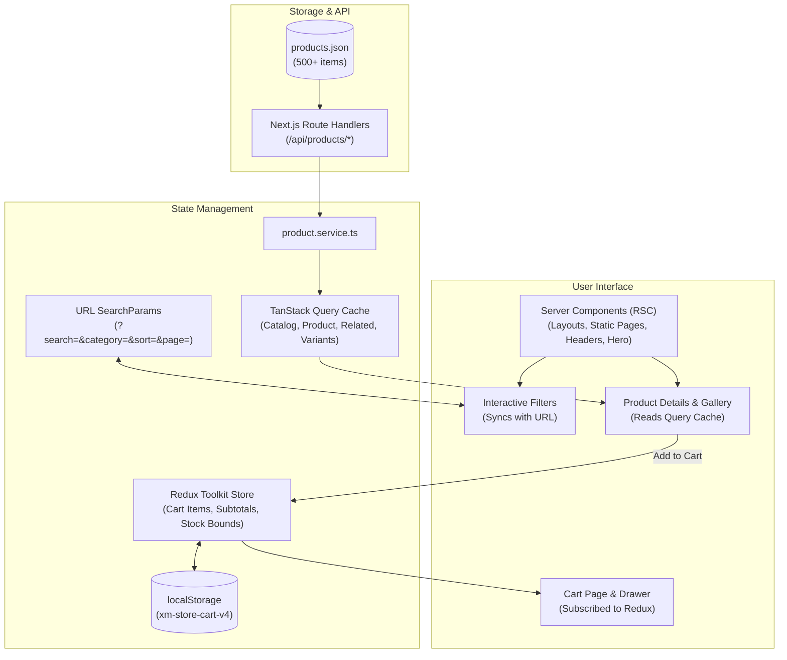

<div align="center">

# 🛒 Easy Cart

**A modern, production-grade e-commerce storefront built with Next.js App Router, React 19, TypeScript, Redux Toolkit, and TanStack Query.**

[](https://easycart-store.netlify.app/)
[](https://nextjs.org/)
[](https://react.dev/)
[](https://www.typescriptlang.org/)
[](https://tailwindcss.com/)
[](https://redux-toolkit.js.org/)
[](https://tanstack.com/query)
[](https://pnpm.io/)

[🌐 **Live Demo**](https://easycart-store.netlify.app/) • [Explore Catalogue](#-key-features) • [Architecture](#-architecture) • [Getting Started](#-getting-started) • [API Reference](#-api--data-fetching)

</div>

---

## 📖 Table of Contents

- [Overview](#-overview)
- [Live Demo](#-live-demo)
- [Key Features](#-key-features)
- [Tech Stack](#-tech-stack)
- [Architecture & Data Flow](#-architecture--data-flow)
- [Folder Structure](#-folder-structure)
- [API & Data Fetching](#-api--data-fetching)
- [Server vs Client Components](#-server-vs-client-components)
- [Getting Started](#-getting-started)
  - [Prerequisites](#prerequisites)
  - [Installation](#installation)
  - [Available Scripts](#available-scripts)
- [Performance & Optimization](#-performance--optimization)
- [Responsive Design & Accessibility](#-responsive-design--accessibility)
- [Error & Loading States](#-error--loading-states)
- [Key Engineering Decisions](#-key-engineering-decisions)
---

## 🌟 Overview

**Easy Cart** is a comprehensive, multi-category e-commerce storefront featuring a **500+ product catalogue**. It delivers a high-performance shopping experience including dynamic search and multifaceted filtering, responsive image galleries with variant selection, a resilient persistent cart with stock clamping, and a type-safe checkout pipeline.

The catalogue spans **8 distinct categories**:
- 📱 Electronics
- 👗 Fashion
- 🏠 Home Decoration
- 💄 Beauty
- ⚽ Sports
- 📚 Books
- 🧸 Toys
- 🥑 Grocery

> [!NOTE]
> **Zero-Config Backend**: Product data is curated in `src/data/products.json` (assembled from DummyJSON, Open Library, Fake Store APIs, plus a legacy set for toys) and served via Next.js API route handlers. No external database or cloud backend is needed to run the project locally.

---

## 🌐 Live Demo

Experience the live storefront deployed on Netlify:

🔗 **[https://easycart-store.netlify.app/](https://easycart-store.netlify.app/)**

> [!TIP]
> Explore real-time keyword search, multifaceted URL-driven filters, product family variant switching, responsive mobile cart drawer, and validated checkout simulation.

---

## ✨ Key Features

### 🛍️ Storefront & Merchandising
- **Home Page**: Hero spotlight featuring top-rated items, curated category cards with custom imagery, trending & new-arrival rows, promotional banners, trust signals, and verified customer testimonials.
- **Content Pages**: Complete static information pages including About, Contact, FAQ, Shipping, Returns, Privacy Policy, Terms, and custom branded 404 & 500 error pages.

### 🔍 Discovery & Filtering (`/products`)
- **URL-Driven State**: All filter parameters (search keyword, category, price bounds, minimum rating, sorting, and pagination) synchronize directly with the browser URL. Links are shareable and bookmarkable.
- **Faceted Filtering**: Category counters, price slider/stepper inputs, star rating selectors, and active-filter dismissible chips.
- **5 Sorting Orders**: Sort by Featured, Price (Low to High), Price (High to Low), Highest Rating, or Newest Arrivals.
- **Pagination & Skeletons**: 18 items per page with background prefetching of the next page and uninterrupted browsing via cached previous data.
- **Mobile Filter Drawer**: Slide-over drawer providing full filtering controls on smaller viewports.

### 📦 Product Detail Pages (`/products/[slug]`)
- **Interactive Gallery**: Thumbnail strip, keyboard navigation (Left/Right arrows), smooth transitions, and broken-image fallbacks.
- **Smart Variant Selector**: Automatically detects real product families (e.g., color, storage, size suffixes) and lets shoppers switch between siblings seamlessly.
- **Inventory Awareness**: Stock-managed quantity steppers preventing over-ordering.
- **Interactive Tabs**: Tabbed interface switching between deep Description, Product Specifications, and Customer Reviews.
- **Engagement**: One-click wishlist toggle, native/clipboard sharing, and context-aware related product recommendations.

### 🛒 Cart & Checkout
- **Dual-Surface Cart**: Full `/cart` page paired with an instant slide-over cart drawer accessible anywhere in the header.
- **Dynamic Math & Progress**: Live subtotal calculations, free-shipping threshold progress bar, and quantity caps strictly bounded by available stock.
- **Persistent Storage**: Real-time hydration with `localStorage` (`xm-store-cart-v4`) guarded against schema drift.
- **Validated Checkout (`/checkout`)**: Form validation powered by **React Hook Form + Zod** supporting Card, Mobile Banking, and Cash on Delivery. Order placement is simulated with instant visual confirmation.

---

## 🛠️ Tech Stack

| Layer | Technology | Purpose |
| :--- | :--- | :--- |
| **Framework** | **Next.js 16.3.5 (App Router)** | Hybrid rendering (RSC + SSR + SSG), API route handlers, image optimization |
| **Library** | **React 19.2.8** | Component architecture & modern concurrent primitives |
| **Language** | **TypeScript 5 (Strict)** | End-to-end type safety across components, store, and APIs |
| **Styling** | **Tailwind CSS v4** | Modern CSS-variable tokens mapped through `@theme inline` |
| **Client State** | **Redux Toolkit 2 + React-Redux 9** | Centralized cart state, stock validation, and persistence middleware |
| **Server State** | **TanStack Query 5** | Data fetching, cache normalization, deduplication, and prefetching |
| **Forms & Validation** | **React Hook Form 7 + Zod 4** | High-performance uncontrolled forms with schema validation |
| **Animations** | **Motion (`motion/react`)** | Fluid micro-interactions and drawers with reduced-motion safeguards |
| **Icons & Typography**| **Lucide React + Geist Fonts** | Crisp iconography and modern web typography |
| **Package Manager**| **pnpm 12.4.2** | Fast, deterministic dependency resolution |

---

## 🏗️ Architecture & Data Flow

The application follows the principle of **Single Source of Truth**: each kind of state is strictly scoped to its domain.



### State Boundaries Summary

- **Redux Toolkit**: Holds **only** cart items (`src/features/cart/`).
- **TanStack Query**: Owns **all** product, detail, related, and variant server data.
- **URL Search Params**: Sole source of truth for catalogue filters, sorting, and pagination.
- **React Hook Form + Zod**: Owns local checkout and newsletter form lifecycles.
- **React Context**: Handles transient UI states only (Cart Drawer toggle and Toast notifications).
- **localStorage**: Client-side storage for cart persistence with sanitizing rehydration.

---

## 📁 Folder Structure

```text
src/
├── app/                          # App Router: routes, layouts, API routes & error boundaries
│   ├── page.tsx                  # Home storefront (Server Component)
│   ├── layout.tsx                # Root layout, meta tags, font setup & global providers
│   ├── products/
│   │   ├── page.tsx              # Product catalogue listing
│   │   └── [slug]/page.tsx       # Statically pre-rendered product detail page
│   ├── cart/page.tsx             # Dedicated cart page
│   ├── checkout/page.tsx         # Validated checkout page
│   ├── api/products/             # RESTful route handlers (list, slug, related, variants)
│   ├── (content)/                # About, Contact, FAQ, Shipping, Returns, Privacy, Terms
│   └── error.tsx / not-found.tsx # Branded boundary and 404 pages
├── components/
│   ├── ui/                       # Reusable UI atoms (Button, Input, Badge, Stepper, Modal...)
│   ├── layout/                   # Header, Footer, Navigation, SearchBar, CartPill
│   ├── home/                     # Hero, FeaturedCategories, ProductRow, PromoBanner
│   ├── filters/                  # Facet sidebar, price range, rating filter, chips
│   ├── products/                 # Product grid, pagination controls, skeleton states
│   ├── product/                  # Star ratings, reviews, trust badges
│   ├── product-card.tsx          # Card with quick add, badge, price & discount
│   ├── product-details.tsx       # Detail view with gallery, tabs, options
│   ├── cart-view.tsx             # Order line items, summary & shipping meter
│   ├── checkout-form.tsx         # Multi-step validated payment form
│   └── providers/                # Redux, React Query, Motion, and Toast providers
├── features/cart/                # Cart slice, selectors, persistence & drawer
├── hooks/                        # Custom hooks wrapping TanStack Query (useProducts, etc.)
├── services/                     # Typed API client functions (product.service.ts)
├── store/                        # Redux store configuration and typed dispatch/selector hooks
├── lib/                          # Business utilities (formatters, filters, shipping calculation)
├── types/                        # TypeScript interfaces (Product, CartItem, Filters, API)
└── data/
    └── products.json             # 564-item rich product catalogue
```

---

## 🔌 API & Data Fetching

All endpoints are hosted as Next.js Route Handlers (`src/app/api/products/`) and operate with `force-dynamic` execution:

| Method | Endpoint | Description | Query Parameters |
| :--- | :--- | :--- | :--- |
| `GET` | `/api/products` | Paginated, filtered, and sorted catalogue | `search`, `category`, `minPrice`, `maxPrice`, `rating`, `sort`, `page`, `limit` |
| `GET` | `/api/products/[slug]` | Single product detail by slug | Returns `404 { error }` if not found |
| `GET` | `/api/products/[slug]/related` | Contextual recommendations (family → category → brand) | `limit` (default: 8, max: 20) |
| `GET` | `/api/products/[slug]/variants`| Validated title family variants | Sibling product matches |

### Fetch Client Example
```ts
// src/services/product.service.ts
export async function getProducts(
  params: ProductQueryParams = {},
): Promise<ProductListResponse> {
  const res = await fetch(`${BASE_PATH}${buildProductsQuery(params)}`);
  return handleResponse<ProductListResponse>(res);
}
```

### TanStack Query Configuration
```ts
// src/lib/query-client.ts
staleTime: 60_000,          // 1 minute fresh window
gcTime: 5 * 60_000,         // 5 minutes garbage collection window
retry: 1,                   // Fail-fast on broken requests
refetchOnWindowFocus: false // Prevents unwanted layout jumps while shopping
```

---

## ⚖️ Server vs Client Components

| Component Type | Components | Key Responsibility |
| :--- | :--- | :--- |
| **Server Components (RSC)** | All `page.tsx` routes, `SiteHeader`, `SiteFooter`, `AnnouncementBar`, `Breadcrumbs`, `HomeHero`, `FeaturedCategories`, `ProductRow`, `FilterSidebar` | Zero client JS footprint; renders fast semantic HTML; computes catalogue logic directly on the server. |
| **Client Components (`"use client"`)** | `CartView`, `CartDrawer`, `CheckoutForm`, `ProductDetails`, `ImageGallery`, `ProductResults`, `Pagination`, `FilterFacets`, `HeaderSearch`, `Toast` | Handles user input, animations, URL mutation, browser storage, and Redux/Query cache subscriptions. |

> [!TIP]
> Product detail pages (`src/app/products/[slug]/page.tsx`) leverage `generateStaticParams()` with `dynamicParams = false`, compiling all 564 product pages into static HTML ahead of time while guaranteeing genuine HTTP 404 responses for unknown slugs.

---

## 🚀 Getting Started

### Prerequisites

- **Node.js**: `18.18` or newer (`Node.js 20+ LTS` recommended)
- **pnpm**: Version `12.x` pinned via `packageManager` (`corepack enable` or `npm i -g pnpm`)

### Installation

```bash
# 1. Clone the repository
git clone https://github.com/MDShakibul/easycart-ecommerce.git

# 2. Navigate into the directory
cd easycart-ecommerce

# 3. Install project dependencies
pnpm install
```

### Environment Variables

> [!NOTE]
> **No environment variables required!** The catalogue is locally contained in `src/data/products.json`, and all checkout/newsletter mechanisms operate deterministically on the client.

### Available Scripts

| Command | Action |
| :--- | :--- |
| `pnpm dev` | Starts local Next.js development server at [http://localhost:3000](http://localhost:3000) |
| `pnpm build` | Compiles optimized production bundle and statically builds all 564 product routes |
| `pnpm start` | Serves the production build locally |
| `pnpm lint` | Runs ESLint 9 checks across the codebase |

---

## ⚡ Performance & Optimization

- **Zero-Layout-Shift Pagination**: The catalogue query applies `keepPreviousData` so previous listings remain visible while the next page loads smoothly.
- **Background Prefetching**: Automatically prefetches `page + 1` into the TanStack Query cache as the shopper views the current page.
- **Optimized Media**: Standardized on `next/image` with responsive `sizes`, WebP/AVIF output, and `priority` preloading reserved exclusively for the Hero and primary product gallery frame.
- **Fine-Grained Redux Selectors**: Components subscribe only to atomic state slices (e.g. `selectCartCount`, `selectCartTotal`), preventing unnecessary re-renders.
- **Selective Memoization**:
  - `useMemo` in `src/hooks/useProducts.ts` guarantees query keys remain referentially stable across filter updates.
  - `useCallback` and `useMemo` in `src/components/ui/toast.tsx` maintain stable dispatcher references for alerts.

---

## ♿ Responsive Design & Accessibility

- **Mobile First**: Built with responsive utility breakpoints (`sm`, `md`, `lg`, `xl`). Desktop two-column layouts collapse to single columns on mobile.
- **Touch Targets**: All interactive elements (steppers, icon buttons, badges) meet or exceed the **44×44px** touch target guideline.
- **A11y Landmarks**: Fully structured using semantic HTML tags (`<header>`, `<nav>`, `<main>`, `<footer>`, `<aside>`).
- **Screen Reader Support**: Star ratings provide ARIA text alternatives (`role="img"` with localized labels), buttons contain explicit `aria-label` attributes, and form fields link to errors with `aria-describedby`.
- **Reduced Motion**: Motion animations respect `prefers-reduced-motion` with global CSS overrides and programmatic `useReducedMotion()` guards.

---

## 🛡️ Error & Loading States

- **Loading Skeletons**: Route-level `loading.tsx` skeletons plus custom `ProductCardSkeleton` and `ProductDetailsSkeleton` preserve page geometry during network transitions.
- **Empty States**: Customized feedback illustrations and call-to-actions for empty carts, empty checkout entries, and zero-match catalogue filters.
- **Resilient Fallbacks**: Image error interceptors replace broken third-party image URLs with a self-hosted SVG placeholder automatically.
- **Error Boundaries**: Unhandled exceptions trigger `error.tsx` offering instant recovery through reset actions.

---

## 💡 Key Engineering Decisions

1. **Dedicated State Isolation**: Redux holds *only* cart state. Storing products or filters in Redux was deliberately rejected to eliminate cache synchronization overhead.
2. **URL as the Catalogue State**: Encoding search and filter parameters into the query string ensures every filtered search result is shareable and survives full-page refreshes.
3. **Internal Stock Protection**: Cart increment reducers clamp quantities against product inventory limits, preventing race conditions or manual bypass.
4. **Unified Business Rules**: Calculations like free shipping thresholds (`≥ $50`, or `$4.95` flat rate in `src/lib/shipping.ts`) are consolidated into pure functions shared across the drawer, cart page, and checkout summary.
5. **Authentic Product Families**: Variants are derived strictly from proven naming conventions in catalog data rather than fabricated mocks, falling back to related items when families do not exist.

